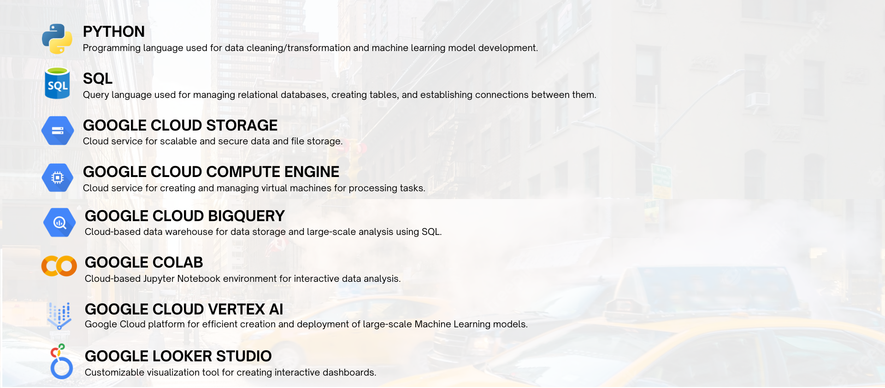
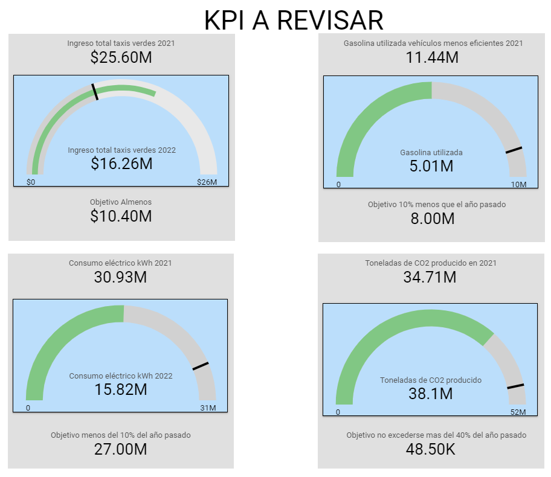
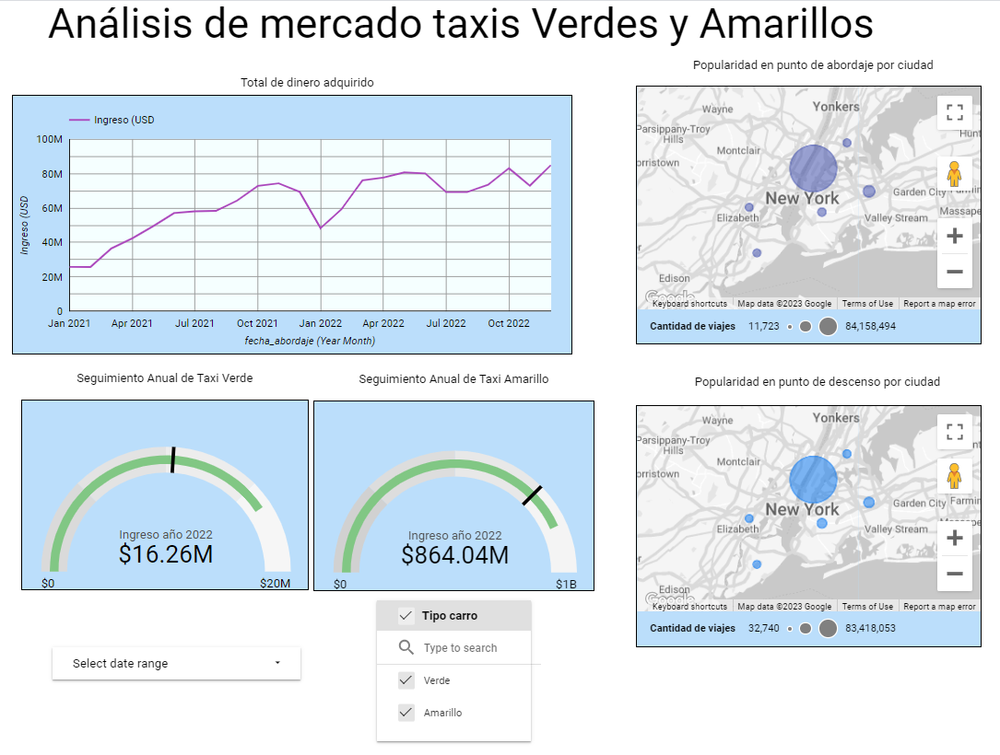
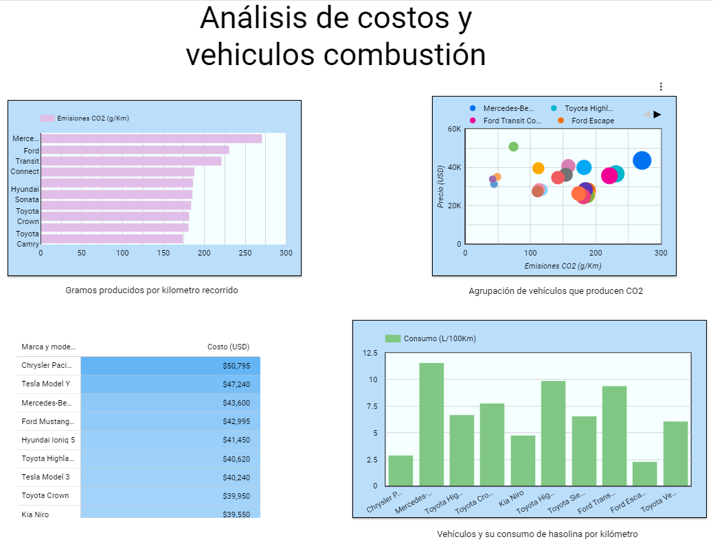
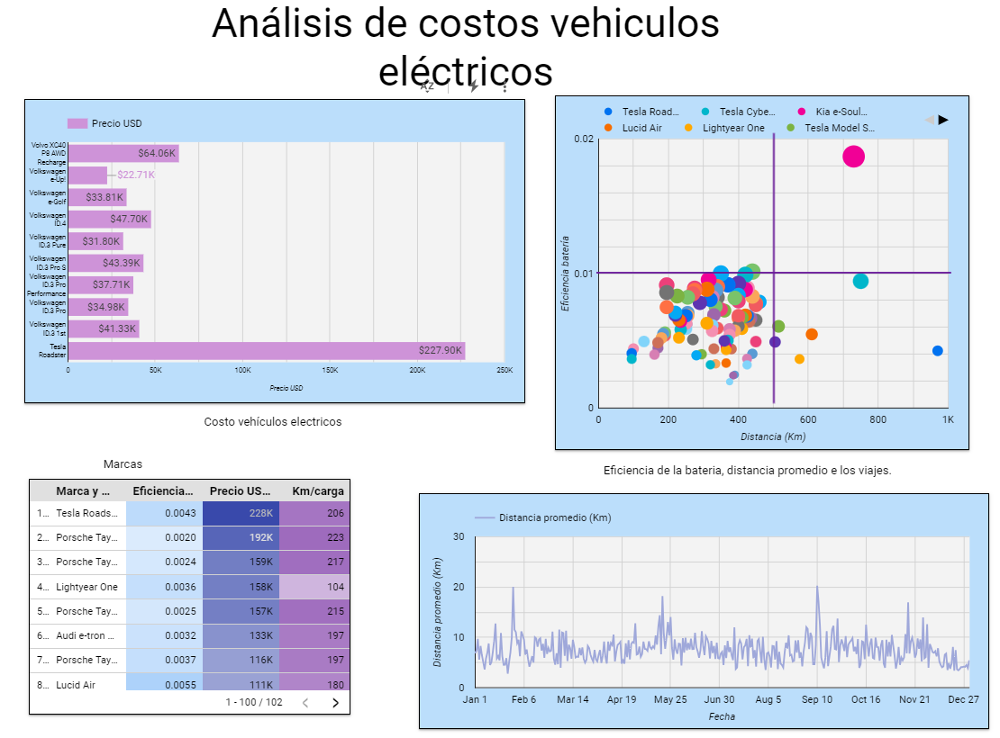

# Análisis de Taxis y Emisiones de CO2 en la Ciudad de Nueva York

## Descripción del Proyecto
Este proyecto tiene como objetivo proporcionar un análisis detallado sobre el mercado de taxis en la ciudad de Nueva York, centrándose en aspectos clave como la cuota de mercado entre taxis amarillos y verdes, el consumo de combustible, consumo electrico de vehículos eléctricos y las mediciones de dióxido de carbono. El análisis está diseñado para brindar información valiosa a empresas interesadas en ingresar a este mercado.

## Key Performance Indicators (KPIs)

### 1. Mantenimiento de la Cuota de Mercado de Taxis Verdes
**Descripción:** Este indicador mide la capacidad de mantener la cuota de mercado de los taxis verdes en la industria de servicios de taxi.

**Objetivo:** El objetivo es mantener una cuota de mercado de los taxis verdes del 40% o superior en un período de 12 meses.

### 2. Reducción del Consumo de Combustible en Modelos no Eficientes
**Descripción:** Este indicador evalúa la capacidad de reducir el consumo de combustible en los modelos menos eficientes de tu flota de vehículos.

**Objetivo:** Reducir el consumo promedio de combustible en los modelos menos eficientes en un 10% en un período de 12 meses.

### 3. Reducción del consumo de electricidad en Vehículos Eléctricos
**Descripción:** Este indicador mide la eficiencia del kilometraje en relación con el costo energético de los vehículos eléctricos.

**Objetivo:** Reducir el consumo de electricidad, comparando en un periódo de 12 meses. El objetivo es asegurarse de que ese valor se mantenga estable o que disminuya. 

### 4. Medición de Dióxido de carbono
**Descripción:** Este KPI evalúa la producción de dióxido de carbono en los viajes realizados en la ciudad de Nueva York. Proporciona información sobre la cantidad que se libera y la sostenibilidad de los vehículos.

**Objetivo:** Objetivo: Mantener los porcentajes de dióxido de carbono por debajo del 20% de aumento, por los siguientes 12 meses. Esto garantizará una mejor calidad del aire y respaldará la sostenibilidad de los vehículos en la ciudad.

## Metodología

El análisis se lleva a cabo en un período de tres semanas, distribuido de la siguiente manera:

### Semana 1: Comprensión de la Problemática y Definición de Objetivos
En esta etapa inicial, se enfoca en comprender a fondo la problemática, establecer los objetivos específicos del proyecto y poner en marcha las actividades necesarias.

### Semana 2: Análisis Profundo de los Datos e Informes
El trabajo de la segunda semana del proyecto estuvo orientado a la ingeniería de datos, a la extracción, limpieza y carga de los mismos a la estructura de Data Warehouse elegida, desarrollo de productos minimos viables de modelo de machine learning y dashboard.

### Semana 3: Entrega de producto de machine learning y dashboard

## Herramientas Utilizadas

### Python
Python es la columna vertebral de nuestro proyecto, respaldado por librerías esenciales como Pandas, Numpy, Seaborn y Matplotlib. Aprovechamos la comodidad de trabajar con las Jupyter Notebooks para realizar transformaciones de datos (ETL) y llevar a cabo análisis exploratorio de los datos (EDA).

### Google Cloud Platform (GCP)
GCP se destaca como una de las principales plataformas de servicios en la nube, y hemos elegido esta plataforma para alojar y gestionar nuestros datos y aplicaciones por varias razones fundamentales:

- **Escalabilidad y Flexibilidad:** GCP ofrece una amplia variedad de servicios que nos permiten escalar nuestras aplicaciones y recursos de manera eficiente. Podemos ajustar nuestros recursos según nuestras necesidades, lo cual es particularmente beneficioso para proyectos que experimentan fluctuaciones en la demanda.

- **Potencia y Rendimiento:** GCP se basa en la infraestructura de Google, reconocida por su velocidad y capacidad de procesamiento. Esto ha facilitado nuestra colaboración en la nube como una alternativa eficiente a trabajar de manera local.

- **Machine Learning e Inteligencia Artificial:** GCP nos brinda herramientas predefinidas por Google para implementar soluciones de Machine Learning e Inteligencia Artificial.

## Dashboard

Como parte del producto, se creó un panel interactivo utilizando la herramienta Looker Studio (GCP). Los datos se alimentaron en BigQuery (GCP) con el fin de organizar la información de las tablas en vistas y reducir los tiempos de espera al actualizar los gráficos en Looker Studio.

En esta primera diapositiva, observamos los cuatro KPI en los que encontramos interés, identificando oportunidades para analizar y mejorar ingresos, así como reducir costos

Las siguientes presentaciones son material de apoyo visual para el cliente.

En cuanto al ingreso de los taxis verdes, notamos una gran diferencia en comparación con los taxis amarillos, ya que la gran mayoría de los viajes son realizados por estos últimos. El mapa que se presenta representa la zona donde se llevan a cabo la mayoría de los viajes.

En la tercera presentación, podemos apreciar la distribución del consumo de gasolina de los vehículos a combustión y la generación de CO2 que representan, agrupándolos según su precio en relación con su nivel de contaminación.

La cuarta presentación revisa aspectos similares a la anterior, pero ahora centrados en los vehículos eléctricos y sus propiedades, como la eficiencia de la batería y el costo del vehículo. Esto nos permite evaluar y categorizar qué vehículos podríamos seguir adquiriendo y cuáles podrían ser reemplazados para reducir gastos innecesarios.

Finalmente, en esta presentación, observamos cómo se ha llevado a cabo la producción de CO2 en Nueva York. Debido a la considerable cantidad de viajes en Manhattan, se generan una cantidad significativa de toneladas que deben ser consideradas en comparación con las demás ciudades aledañas.

## Roles

En nuestro proyecto, contamos con tres roles fundamentales:

### Data Scientist
- **Maria Leiton**
- **Joaquin Amarilla**

Los Data Scientists desempeñan un papel fundamental en nuestro equipo, siendo figuras esenciales en la generación de insights a partir de los datos.

### Data Analysts
Los Data Analysts en nuestro equipo se dedican principalmente a tareas relacionadas con el análisis de datos. Dos de los miembros que desempeñan este rol son:

- **Oswaldo Garcia**
- **Mariano Acosta**

Estos profesionales tienen la responsabilidad de extraer, depurar, analizar y presentar los datos de una manera que sea relevante y permita tomar decisiones informadas.

### Data Engineers
Los Data Engineers en nuestro equipo se centran principalmente en tareas relacionadas con la ingeniería de datos. 
- **Nicolas Aranda**

Los Data Engineers se dedican principalmente a labores vinculadas con la ingeniería de datos. Su función primordial es diseñar, implementar y mantener las infraestructuras de datos y los pipelines que facilitan la recolección, procesamiento y almacenamiento eficaz de la información.

## Flujo de trabajo - Diagrama de Gantt
[Click here](https://docs.google.com/spreadsheets/d/e/2PACX-1vRDAku0N05gw6yRoVvx4lRjuNDqZNwWEoO_Z4Xl1MBCnRSfeX7JnhesaMt92KEtM_wYRuHNJmFYy2HI/pubhtml)

